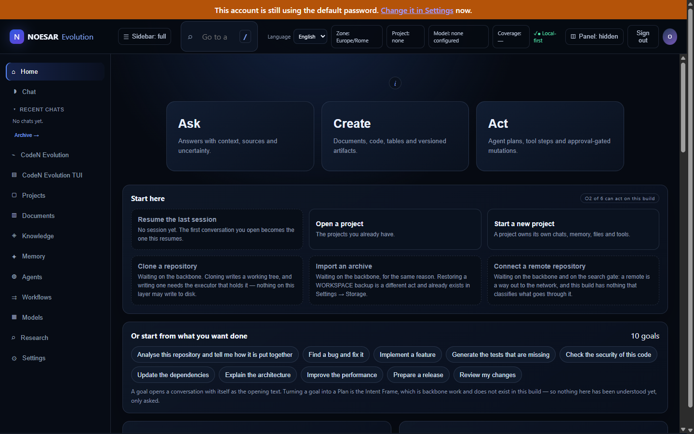
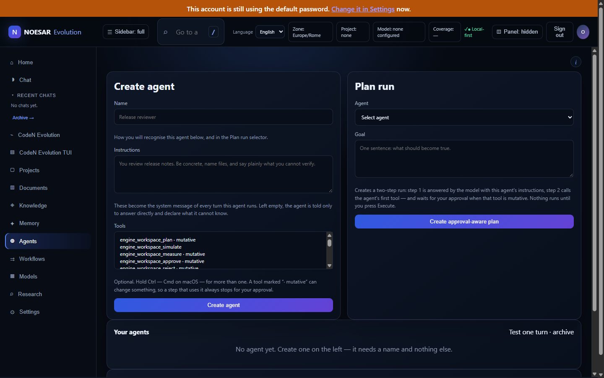

<div align="center">

<picture>
  <source media="(prefers-color-scheme: dark)" srcset="docs/brand/noesar-horizontal-on-dark.svg">
  
</picture>

<br>

### Self-hosted AI that is allowed to act — without holding the authority to act

**The model proposes. Policy decides. A sandbox executes. A ledger records — including what was refused.**

<br>

[](#run-it)
[](LICENSE)
[](#offline-by-default)
[](docs/ATOM_ABSENT_ACCEPTANCE.md)

[](#every-badge-above-has-a-command-behind-it)
[](#every-badge-above-has-a-command-behind-it)
[](#what-the-model-may-do)
[](#what-the-model-may-do)
[](#what-the-model-may-do)

📄 **[Architecture](ARCHITECTURE.md)** · **[Everything it does](FEATURES.md)** · **[Every decision, with its evidence](docs/DECISION_LOG.md)** · **[Security](SECURITY.md)**

Built in Italy by **Alessandro Barci**

</div>

---

## What it looks like

Both shots are a real installation, not a mock-up: Windows 11, release `0.1.0`, installed from a
clean clone on 2026-09-18 and photographed on its first run. The orange strip is the product
enforcing its own rule — the first sign-in uses a password every installation starts with, and it
says so until you change it.

<p align="center">
  
</p>

The one below is the claim this project is built around, in the interface rather than in a
document: every tool the engine exposes is labelled, and a step that uses one marked
**· mutative** stops and waits for a person.

<p align="center">
  
</p>

## The problem

Useful AI work increasingly means letting a model **act** — read a repository, run a command,
change a file, reach the network. Every product that offers this has to answer one question:
**what stops the action when the model is wrong?**

Today the answer is almost always one of three, and all three are bad for the operator:

1. **Trust the model.** A better prompt, a safety layer trained by the same vendor. The control
   is statistical, unauditable, and revised without notice.
2. **Trust the cloud.** The work, the code, the documents and the memory leave the machine.
   Sovereignty, confidentiality and offline operation are lost together — and the audit trail,
   if there is one, belongs to the vendor.
3. **Give up the acting.** A chat that can only describe what you should do, which is where most
   self-hosted deployments end up, because the safe version is the inert one.

NOESAR EVOLUTION is the fourth answer: **a local system where the model may act, and the
authority to act is held by something other than the model.**

```
AI proposes  →  policy decides  →  sandbox executes  →  verifier checks  →  audit records
```

Capability tokens are what cross that boundary. A call arriving with no declared authority is
**refused, not defaulted** — which is the difference between a boundary and a convention.

## What the model may do

The boundary is not a promise in a document; it is a table in the code, and the tool registry is
derived from it rather than hand-kept beside it.

| Effect | Methods | Registered as tools |
|---|---:|---|
| `read` | 21 | yes |
| `write` | 11 | yes — **every call waits for a human approval mid-turn** |
| `destroy` | 2 | **no. They do not ship as tools at all.** |

The two destroying methods (`replay.sweep`, `sessions.action`) are classified, schema'd, reachable
by a person in the terminal behind a typed confirmation word — and deliberately never handed to a
model. A model emitting JSON has no equivalent of typing a word on purpose.

```bash
node -e "import('./services/reference-control-plane/src/ai-workspace/builtin-tools.mjs')
  .then(m => console.log(m.EFFECT, m.SEEDED_EFFECTS))"
```

## What it is

A self-hosted AI workspace — chat, documents, knowledge, agents, automation and a coding agent —
running as **one externally visible OCI container** on infrastructure the operator controls.
Inside it: PostgreSQL 18 with pgvector and enforced row-level isolation, a model-independent
authority boundary, and **CodeN Evolution**, an agentic coding workspace reachable from two
shells — a browser WebUI and `ssh` — attached to the *same live session*.

The product is organised around three modes:

- **Ask** — research, source-grounded answers with citations, controlled retrieval;
- **Create** — editable documents, code, tables, charts, canvases;
- **Act** — agents, tools, approvals, scheduled work and auditable execution.

**[`FEATURES.md`](FEATURES.md) lists everything that is built**, one line each. Nothing is listed
there that is not built and tested.

### Offline by default

The core builds, starts, runs and passes its own suite with **no external network reachable and no
API key**. External providers (OpenAI, Anthropic, Moonshot/Kimi, or any OpenAI-compatible endpoint)
are opt-in, disabled by default, credential-encrypted and consent-scoped. Local
OpenAI-compatible servers are the default path, not the degraded one.

The core also runs with **no proprietary component present at all** — not as a claim, as a run:
`FOSS_CORE_DEPENDS_ON_ATOM=false`, measured in
[`docs/ATOM_ABSENT_ACCEPTANCE.md`](docs/ATOM_ABSENT_ACCEPTANCE.md) (image built with
`--network=none`, container starts and serves, suites green, zero references to any reserved
component in what actually runs).

## Run it

One image, one container.

```bash
bash deployment/docker/build.sh
bash deployment/docker/run.sh
```

Unraid has a direct installer:

```bash
./INSTALLATION/install-unraid.sh
./INSTALLATION/verify-installation.sh
```

Podman, Linux, macOS and Windows have their own paths, and one page walks all of them:
**[the installation guide](INSTALLATION/README.md)** — which command for which platform, the four
answers that prove it really came up, the first sign-in, where your data lives, and what each
platform's uninstaller does and does not do. Every command on it was run on 2026-09-18 except the
macOS ones, which nobody has ever executed, and it says so there too.

> **Portability, stated honestly.** On **Windows 11** the whole path was walked on 2026-09-18 for
> release 0.1.0 — clean clone, install, notices, first start, `/livez`, `/readyz`,
> `/api/v1/auth/status` and the first sign-in — and every command is in
> [`docs/INSTALLATION_LEDGER.md`](docs/INSTALLATION_LEDGER.md). On **Linux** the product runs as the
> development host, and `deployment/linux/install-portable.sh` was executed from this tree the same
> day. **macOS has never been run by anyone**: its installer is carried and statically checked,
> which is not the same as proven, and the difference is the point of this paragraph.

## Every badge above has a command behind it

Measured on **2026-09-18** at `5ac3e745`, on the development host, from this repository, except
where a row says otherwise:

| Claim | Command | Result |
|---|---|---|
| Unit suite | `npm test` | 3290 tests, 354 suites — **3289 pass, 0 fail, 1 skip** |
| Static analysis | `bash tools/run-eslint.sh` | ESLint 9.39.5 — **491 files, 0 errors, 0 warnings** |
| Verification battery | `sh scripts/test.sh` | **pass=22, fail=0, partial=0, unavailable=0** |
| Installer parity | `node tools/test-cross-platform-installers.mjs` | **124 checks, 0 failures** — Linux and macOS executed, Windows read statically |
| Engine surface | the `node -e` line under [What the model may do](#what-the-model-may-do) | **34 methods — 21 read, 11 write, 2 destroy**; 32 registered as tools, 0 of them destroying |
| Rust workspace | `cargo test --workspace --offline` | vendored, no network — **last measured 2026-09-01**, in `rust:1-bookworm`, and not re-run since |
| Repository manifest | `node tools/generate-manifest.mjs` | 6 734 files |

A number in this README that a reader cannot reproduce is a defect. If one of the commands above
disagrees with the badge, the badge is wrong — open an issue.

## Status

**Actively developed. `production_ready` is `false` in the product's own state file, and this page
does not contradict it.** The gate that holds it there is an independent third-party security
audit — by definition not something the author can perform on their own work. The scope is written
and dated ([`docs/security/INDEPENDENT_PENTEST_SCOPE.md`](docs/security/INDEPENDENT_PENTEST_SCOPE.md)),
and its own first line says **"Status: not run."**

[`docs/SESSION_HANDOFF.md`](docs/SESSION_HANDOFF.md) states exactly what is done, what is in
progress and what is open, as of the most recent session. Read that rather than a number frozen at
README-authoring time.

## Architecture and governance

| | |
|---|---|
| [`ARCHITECTURE.md`](ARCHITECTURE.md) | system design |
| [`FEATURES.md`](FEATURES.md) | what is built, one line each |
| [`SECURITY.md`](SECURITY.md) | security posture and reporting |
| [`docs/DECISION_LOG.md`](docs/DECISION_LOG.md) | every non-trivial decision, with its evidence |
| [`MASTER_PROJECT/`](MASTER_PROJECT/) | the design documents this rewrite is built from |

## Generative AI

This project uses generative AI, and declares it here because
[NLnet's policy on the use of generative AI](https://nlnet.nl/foundation/policies/generativeAI/)
(version 1.1, valid as of 26 January 2026) asks a codebase to state, in its readme, how it does so.

**Which model.** Claude Opus 5 and Claude Sonnet 5 (Anthropic), through Claude Code, directed turn
by turn by the author.

**What for.** Implementation, tests, refactoring, measurement and documentation. The author reviews
what is merged and remains accountable for it; design, security and licensing decisions are the
author's and are recorded with their evidence in [`docs/DECISION_LOG.md`](docs/DECISION_LOG.md).

**Per commit.** Commits carrying generated work name the model and its version in a
`Co-Authored-By` trailer, so provenance is attached to the change rather than to this page.
Count them yourself:

```
git log --format=%B | grep -ci "co-authored-by:.*claude"
```

The disclosure written for the grant application, including the sessions whose transcripts no
longer exist, is [`FUNDING/20_GENAI_DISCLOSURE.md`](FUNDING/20_GENAI_DISCLOSURE.md).

## An early version — tell me what breaks, and what should be different

`0.1.0` is published as a **pre-release**, and the word is meant literally: it is the first
version of this that somebody other than its author can install, and the reason to put it out is
to find out what happens when it meets a machine nobody here has ever seen. Expect to find
defects. Finding one is the point, not an accident.

**Something is broken** → [report a defect](https://github.com/komandante78/noesar-evolution-core/issues/new?template=bug_report.yml). The form asks
for the version, the platform and the installer you actually ran, because those three decide which
half of this product you are standing in — the same defect can be a two-line fix on one platform
and absent on another.

**Something should be different** → [say so](https://github.com/komandante78/noesar-evolution-core/issues/new?template=idea.yml). An idea does not
have to be a finished design, and "this was confusing" is a real report: a screen that needs
explaining is a defect in the screen.

**A security vulnerability never goes in a public issue while it is unfixed.**
[`SECURITY.md`](SECURITY.md) says where it goes instead.

**You want to send code** → [`CONTRIBUTING.md`](CONTRIBUTING.md). It names the gate that runs on
every commit, the one step that will make the suite go red if you skip it, and the four things
that will fail a change here whatever else is right about it.

What counts as a defect here is wider than a crash. A number in this README that you cannot
reproduce is one. So is a screen that tells you something untrue, or a document that describes a
product this repository does not contain. [`docs/OPEN_FINDINGS.tsv`](docs/OPEN_FINDINGS.tsv)
carries the ones already found, with the evidence and what was decided about each, and
[`CHANGELOG.md`](CHANGELOG.md) names what the current release does not do and which platforms
nobody has run. Check those two before reporting one of them — and report it anyway if the entry
is wrong.

## License

[`AGPL-3.0-or-later`](LICENSE) for the open core, with an additional commercial license planned for
parties who cannot accept AGPL — see `docs/LICENSE_STRATEGY.md`. Reserved components are named and
bounded rather than implied: the contracts are published, specific implementations are not. A
boundary you disclose is credible; one a reviewer discovers is not.
