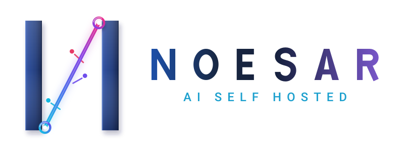

<div align="center">

<picture>
  <source media="(prefers-color-scheme: dark)" srcset="docs/brand/noesar-horizontal-on-dark.svg">
  
</picture>

<br>

### Self-hosted AI that is allowed to act — without holding the authority to act

**The model proposes. Policy decides. A sandbox executes. A ledger records — including what was refused.**

<br>

[](#run-it)
[](LICENSE)
[](#offline-by-default)
[](docs/ATOM_ABSENT_ACCEPTANCE.md)

[](#every-badge-above-has-a-command-behind-it)
[](#every-badge-above-has-a-command-behind-it)
[](#what-the-model-may-do)
[](#what-the-model-may-do)
[](#what-the-model-may-do)

📄 **[Architecture](ARCHITECTURE.md)** · **[Everything it does](FEATURES.md)** · **[Every decision, with its evidence](docs/DECISION_LOG.md)** · **[Security](SECURITY.md)**

</div>

---

## The problem

Useful AI work increasingly means letting a model **act** — read a repository, run a command,
change a file, reach the network. Every product that offers this has to answer one question:
**what stops the action when the model is wrong?**

Today the answer is almost always one of three, and all three are bad for the operator:

1. **Trust the model.** A better prompt, a safety layer trained by the same vendor. The control
   is statistical, unauditable, and revised without notice.
2. **Trust the cloud.** The work, the code, the documents and the memory leave the machine.
   Sovereignty, confidentiality and offline operation are lost together — and the audit trail,
   if there is one, belongs to the vendor.
3. **Give up the acting.** A chat that can only describe what you should do, which is where most
   self-hosted deployments end up, because the safe version is the inert one.

NOESAR EVOLUTION is the fourth answer: **a local system where the model may act, and the
authority to act is held by something other than the model.**

```
AI proposes  →  policy decides  →  sandbox executes  →  verifier checks  →  audit records
```

Capability tokens are what cross that boundary. A call arriving with no declared authority is
**refused, not defaulted** — which is the difference between a boundary and a convention.

## What the model may do

The boundary is not a promise in a document; it is a table in the code, and the tool registry is
derived from it rather than hand-kept beside it.

| Effect | Methods | Registered as tools |
|---|---:|---|
| `read` | 21 | yes |
| `write` | 9 | yes — **every call waits for a human approval mid-turn** |
| `destroy` | 2 | **no. They do not ship as tools at all.** |

The two destroying methods (`replay.sweep`, `sessions.action`) are classified, schema'd, reachable
by a person in the terminal behind a typed confirmation word — and deliberately never handed to a
model. A model emitting JSON has no equivalent of typing a word on purpose.

```bash
node -e "import('./services/reference-control-plane/src/ai-workspace/builtin-tools.mjs')
  .then(m => console.log(m.EFFECT, m.SEEDED_EFFECTS))"
```

## What it is

A self-hosted AI workspace — chat, documents, knowledge, agents, automation and a coding agent —
running as **one externally visible OCI container** on infrastructure the operator controls.
Inside it: PostgreSQL 18 with pgvector and enforced row-level isolation, a model-independent
authority boundary, and **CodeN Evolution**, an agentic coding workspace reachable from two
shells — a browser WebUI and `ssh` — attached to the *same live session*.

The product is organised around three modes:

- **Ask** — research, source-grounded answers with citations, controlled retrieval;
- **Create** — editable documents, code, tables, charts, canvases;
- **Act** — agents, tools, approvals, scheduled work and auditable execution.

**[`FEATURES.md`](FEATURES.md) lists everything that is built**, one line each. Nothing is listed
there that is not built and tested.

### Offline by default

The core builds, starts, runs and passes its own suite with **no external network reachable and no
API key**. External providers (OpenAI, Anthropic, Moonshot/Kimi, or any OpenAI-compatible endpoint)
are opt-in, disabled by default, credential-encrypted and consent-scoped. Local
OpenAI-compatible servers are the default path, not the degraded one.

The core also runs with **no proprietary component present at all** — not as a claim, as a run:
`FOSS_CORE_DEPENDS_ON_ATOM=false`, measured in
[`docs/ATOM_ABSENT_ACCEPTANCE.md`](docs/ATOM_ABSENT_ACCEPTANCE.md) (image built with
`--network=none`, container starts and serves, suites green, zero references to any reserved
component in what actually runs).

## Run it

One image, one container.

```bash
bash deployment/docker/build.sh
bash deployment/docker/run.sh
```

Unraid has a direct installer:

```bash
./INSTALLATION/install-unraid.sh
./INSTALLATION/verify-installation.sh
```

Assets for Podman, Linux, macOS and Windows live under `deployment/`.

> **Portability, stated honestly.** This has been installed and exercised on **one** host. The
> project's own rules already forbid presuming a second one — but not presuming is not the same as
> having proven it. Cross-platform installation evidence is open work, and it is named as such in
> [`docs/SESSION_HANDOFF.md`](docs/SESSION_HANDOFF.md) rather than blurred here.

## Every badge above has a command behind it

Measured on **2026-09-01**, on the development host, from this repository:

| Claim | Command | Result |
|---|---|---|
| Unit suite | `npm test` | 3161 tests, 345 suites — **3160 pass, 0 fail, 1 skip** |
| Static analysis | `bash tools/run-eslint.sh` | ESLint 9.39.5 — **494 files, 0 errors, 0 warnings** |
| Verification battery | `sh scripts/test.sh` | **pass=22, fail=0, partial=0, unavailable=0** |
| Rust workspace | `cargo test --workspace --offline` | vendored, no network |
| Repository manifest | `node tools/generate-manifest.mjs` | 6 738 files |

A number in this README that a reader cannot reproduce is a defect. If one of the commands above
disagrees with the badge, the badge is wrong — open an issue.

## Status

**Actively developed. `production_ready` is `false` in the product's own state file, and this page
does not contradict it.** The gate that holds it there is an independent third-party security
audit — by definition not something the author can perform on their own work. The scope is written
and dated ([`docs/security/INDEPENDENT_PENTEST_SCOPE.md`](docs/security/INDEPENDENT_PENTEST_SCOPE.md)),
and its own first line says **"Status: not run."**

[`docs/SESSION_HANDOFF.md`](docs/SESSION_HANDOFF.md) states exactly what is done, what is in
progress and what is open, as of the most recent session. Read that rather than a number frozen at
README-authoring time.

## Architecture and governance

| | |
|---|---|
| [`ARCHITECTURE.md`](ARCHITECTURE.md) | system design |
| [`FEATURES.md`](FEATURES.md) | what is built, one line each |
| [`SECURITY.md`](SECURITY.md) | security posture and reporting |
| [`docs/DECISION_LOG.md`](docs/DECISION_LOG.md) | every non-trivial decision, with its evidence |
| [`MASTER_PROJECT/`](MASTER_PROJECT/) | the design documents this rewrite is built from |

## License

[`AGPL-3.0-or-later`](LICENSE) for the open core, with an additional commercial license planned for
parties who cannot accept AGPL — see `docs/LICENSE_STRATEGY.md`. Reserved components are named and
bounded rather than implied: the contracts are published, specific implementations are not. A
boundary you disclose is credible; one a reviewer discovers is not.
