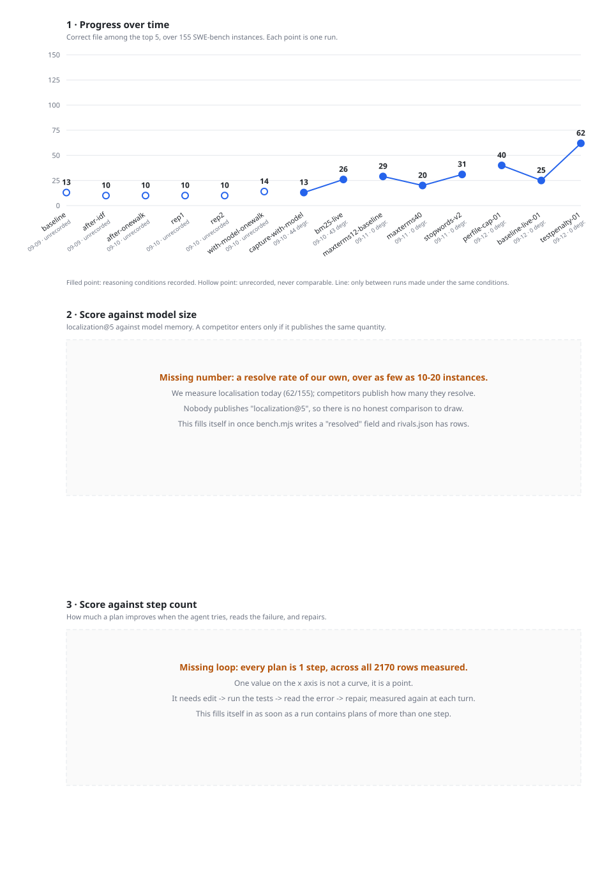

# Measurements

Regenerated by `curve.mjs` at the end of every `run-bench.sh`. Latest run: `testpenalty-01`, 2026-09-12 09:50 UTC.

## Where we are

Best localisation: **62/155 (40.0%)**, in run `testpenalty-01`.
No degradation recorded in the latest run.

| run | date | commit | top-5 | % | degraded | conditions |
|---|---|---|---|---|---|---|
| `baseline` | 2026-09-09 | **unrecorded** | 13/155 | 8.4 | — | **unrecorded** |
| `after-idf` | 2026-09-09 | **unrecorded** | 10/155 | 6.5 | — | **unrecorded** |
| `after-onewalk` | 2026-09-10 | **unrecorded** | 10/155 | 6.5 | — | **unrecorded** |
| `rep1` | 2026-09-10 | **unrecorded** | 10/155 | 6.5 | — | **unrecorded** |
| `rep2` | 2026-09-10 | **unrecorded** | 10/155 | 6.5 | — | **unrecorded** |
| `with-model-onewalk` | 2026-09-10 | **unrecorded** | 14/155 | 9.0 | — | **unrecorded** |
| `capture-with-model` | 2026-09-10 | **unrecorded** | 13/155 | 8.4 | 44 | recorded |
| `bm25-live` | 2026-09-10 | **unrecorded** | 26/155 | 16.8 | 43 | recorded |
| `maxterms12-baseline` | 2026-09-11 | **unrecorded** | 29/155 | 18.7 | 0 | recorded |
| `maxterms40` | 2026-09-11 | **unrecorded** | 20/155 | 12.9 | 0 | recorded |
| `stopwords-v2` | 2026-09-11 | **unrecorded** | 31/155 | 20.0 | 0 | recorded |
| `perfile-cap-01` | 2026-09-12 | **unrecorded** | 40/155 | 25.8 | 0 | recorded |
| `baseline-live-01` | 2026-09-12 | **unrecorded** | 25/155 | 16.1 | 0 | recorded |
| `testpenalty-01` | 2026-09-12 | **unrecorded** | 62/155 | 40.0 | 0 | recorded |

## What can be compared

- `capture-with-model` -> `bm25-live`: **+13** out of 155, same reasoning conditions.
- `maxterms12-baseline` -> `maxterms40`: **-9** out of 155, same reasoning conditions.
- `maxterms40` -> `stopwords-v2`: **+11** out of 155, same reasoning conditions.
- `perfile-cap-01` -> `baseline-live-01`: **-15** out of 155, same reasoning conditions.
- `baseline-live-01` -> `testpenalty-01`: **+37** out of 155, same reasoning conditions.

Pairs are ordered by the clock. A pair with an **unrecorded** commit cannot be read as before -> after: a baseline is sometimes re-measured AFTER the change it is the baseline for, which is what makes it comparable at all.

6 of 14 runs predate the fingerprint (`baseline`, `after-idf`, `after-onewalk`, `rep1`, `rep2`, `with-model-onewalk`): they are comparable with nothing, and a difference between them would measure the conditions rather than the change.

## What the two empty panels are waiting for

1. **Size**: a *resolve rate* of our own. Today we measure whether the right file is among the top five; competitors publish how many instances they resolve. Those are different quantities and do not share an axis. It needs `bench.mjs` to write `resolved`, and `rivals.json` to carry rows with a source and a date.
2. **Steps**: the edit -> test -> repair loop. Every plan measured is **a single step**, so the x axis holds one value and no curve exists.

Both panels fill themselves in when that data appears. Nothing here is redrawn by hand.
